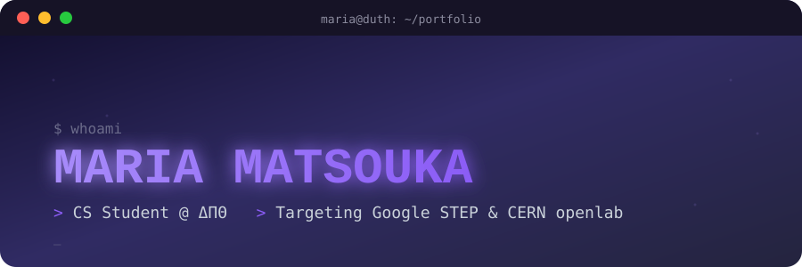

<div align="center">



<br/>

[](https://git.io/typing-svg)

<br/>


</div>

<br/>

## `~/about-me`

```yaml
name:      Maria Matsouka
role:      First-Year CS Student @ Democritus University of Thrace (ΔΠΘ)
based_in:  Kavala, Greece 🇬🇷
learning:  CS50, CS50P, CS50W, CS50 SQL (Harvard) · Code in Place (Stanford)
targeting: Google STEP Internship · CERN openlab Summer Student — Summer 2027
freelance: WordPress / WooCommerce web support
english:   Cambridge English Proficiency (CPE) — Distinction
mindset:   consistent > perfect 🌱
```

<br/>

## `~/tech-stack`

<div align="center">


</div>

<br/>

## `~/github-stats`

<div align="center">


</div>

<br/>

## `~/activity`

<div align="center">


</div>

<br/>

<div align="center">


</div>

<br/>

## `~/links`

<div align="center">

[](https://mariawww.dev)
[](https://github.com/matsouka-maria)
[](https://linkedin.com/in/YOUR-LINKEDIN)

</div>

<br/>


<div align="center">
<sub>💬 building my way, one commit at a time.</sub>
</div>
